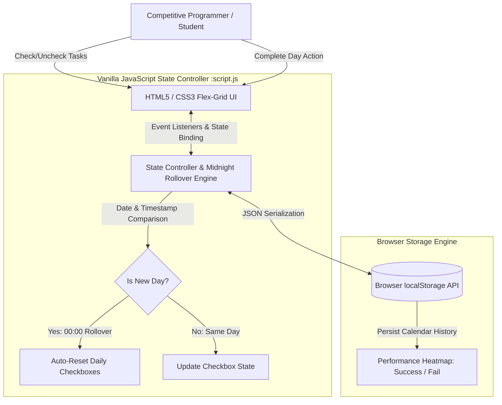

# Mission | Daily Protocol Tracker 

---

> "Discipline > Motivation"

A minimalist, daily-resetting checklist designed for high-performance tracking. Built to maintain consistency in Competitive Programming and algorithmic study.

##  Features
* Daily Auto-Reset: The checklist automatically unchecks itself at the start of a new day (local time).
* Performance History: Tracks your daily completion status (Success/Fail) and visualizes it on a calendar grid.
* Persistent Data: Uses `localStorage` to save your history and checkbox state, so you never lose progress upon refresh.
* Visual Feedback:
    * Green: Day Completed (All tasks done).
    * Red: Day Failed (Tasks missed).
    * White Border: Current Day.
* Privacy First: All data is stored locally in your browser. No databases, no tracking.

## System Architecture & Midnight Rollover Flow



##  Tech Stack
* Frontend: HTML5, CSS3 (Modern Flexbox/Grid)
* Logic: Vanilla JavaScript (ES6+)
* Storage: Browser LocalStorage API

## How to Run Locally
1. Clone the repository:
    ```bash
    git clone [https://github.com/YOUR_USERNAME/mission-tracker.git](https://github.com/YOUR_USERNAME/mission-tracker.git)
    ```
2. Open `index.html` in your browser.

##  Usage
1. Check off your tasks as you complete them throughout the day.
2. Click "COMPLETE DAY" before midnight.
3. If all tasks are done, the day is marked as Success in the calendar.
4. If you forget to log a day, it is automatically marked as Failed the next time you visit.

## Customization
To change the tasks, edit the `TASK_IDS` array and the HTML in `index.html`.

---
*Built by [Anshul Kumar](https://github.com/anshullakra007)*
---